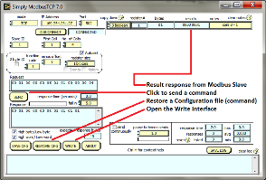
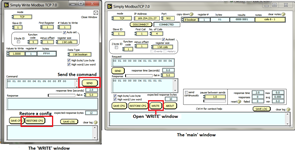
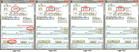
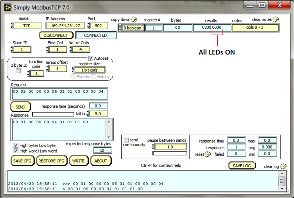
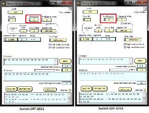
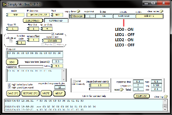
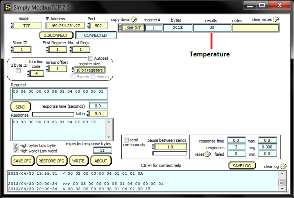
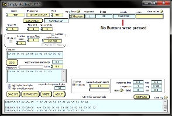
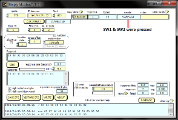

Modbus TCP demo quickstart guide
================================

This simple demonstration of xTIMEcomposer Studio functionality that uses the ``XA-SK-E100`` and ``XA-SK-GPIO`` sliceCARDs together with the xSOFTip ``module_modbus_tcp`` to demonstrate how the module is used to receive commands from a Modbus Master over TCP and service them to:

- Turn GPIO sliceCARD LEDs ON and OFF
- Read the room temperature via the on-board ADC
- Display GPIO sliceCARD button presses

Host computer setup
+++++++++++++++++++

A Modbus Master application such as Simply Modbus TCP. Simply Modbus PC application is available from http://www.simplymodbus.ca/TCPclient.htm. Download the installer and install the application on your PC by running it. You can open the Modbus master emulator using Start -> All Programs -> Simply Modbus -> Simply Modbus TCP.

Using SimplyModbus PC application
---------------------------------

Simply Modbus TCP application is a Modbus (TCP) master emulator program that runs on a PC. Using this software, Modbus master commands could be sent to a slave over TCP. Modbus Master commands could be formed in this application by setting various parameters. Please see the online manual for SimplyModbus TCP here: http://www.simplymodbus.ca/TCPmanual.htm for help on creating Modbus commands.

The commands could also be stored (saved) and restored to/from the PC memory for later use. These saved files may also be called as configurations. The folder ($\\app_modbus_tcp\\simplymodbus_config\\) contains sample Simply Modbus TCP specific configuration files to perform Read / Write operations. These files can be loaded by clicking on ``RESTORE CFG`` button from the Simply Modbus PC application.

Hardware setup
++++++++++++++

The Modbus TCP Demo Application requires the following items:

- XP-SKC-L16 sliceKIT core board
- XA-SK-E100 Ethernet sliceCARD
- XA-SK-GPIO GPIO sliceCARD
- XTAG2 and XTAG adapter
- Ethernet Cable and
- 12V DC power supply

To setup the system:

#. Connect the XA-SK-E100 sliceCARD to the sliceKIT Core board using the connector marked with the ``CIRCLE``.
#. Connect the XA-SK-GPIO sliceCARD to the sliceKIT Core board using the connector marked with the ``SQUARE``.
#. Connect the XTAG Adapter to sliceKIT core board and connect XTAG-2 to the adapter.
#. Connect the XTAG-2 to host PC.
#. Connect an Ethernet cable between the XA-SK-E100 sliceCARD and host PC.
#. Switch on the power supply to the sliceKIT core board.

.. figure:: images/hardware_setup.jpg
   :align: center

   Hardware Setup for a Modbus TCP Demo

Import and build the application
++++++++++++++++++++++++++++++++

Using xTIMEcomposer Studio
--------------------------

#. Open the xTIMEcomposer Studio and check that it is operating in online mode. Open the edit perspective (Window->Open Perspective->XMOS Edit).
#. Locate the ``Modbus TCP Demo`` item in the xSOFTip pane on the bottom left of the window and drag it into the Project Explorer window in the xTIMEcomposer. This will also cause the modules on which this application depends to be imported as well.
#. Click on the ``app_modbus_tcp`` item in the Project Explorer pane then click on the build icon (hammer) in xTIMEcomposer. Check the console window to verify that the application has built successfully.

For help in using xTIMEcomposer, try the xTIMEcomposer tutorial, which you can find by selecting (Help->Tutorials) from the xTIMEcomposer menu.

Note that the Developer Column in the xTIMEcomposer on the right hand side of your screen provides information on the xSOFTip components you are using. Select the module_modbus_tcp component in the Project Explorer, and you will see its description together with API documentation. Having done this, click the `back` icon until you return to this quick start guide within the Developer Column.

Run the application
+++++++++++++++++++

Using xTIMEcomposer Studio
--------------------------

Now that the application has been compiled, the next step is to run it on the sliceKIT core board using the tools to load the application over JTAG (via the XTAG2 and XTAG Adapter card) into the xCORE multicore microcontroller.

- Select the file ``app_modbus_tcp.xc`` in the ``app_modbus_tcp`` project from the Project Explorer.
- Click on the ``Run`` icon (the white arrow in the green circle).
- At the ``Select Device`` window, select ``XMOS XTAG-2 connect to L1[0..1]`` and click ``OK``.

The demo
---------

This demo issues commands to read: coils, input register and discrete inputs and write: coils. Using the XA-SK-GPIO sliceCARD, the coils, etc... are mapped as follows:

   ================  =======================
   Device            on XA-SK-GPIO sliceCARD
   ================  =======================
   Coils             LEDs LED0 - LED3
   Input Register    Temperature Sensor
   Discrete Input    Buttons SW1 & SW2
   Holding Register  N/A
   ================  =======================

Once the run has started the console output should print an IP address::

   IP address: 169.254.231.27

On your PC, open the SimplyModbus Client from (Start -> All Programs -> Simply Modbus -> Simply Modbus TCP) and adjust to following settings:

   * mode = TCP
   * Set the IP address to the address printed out as per above.
   * Port = 502 (Modbus Listening Port)

Alternatively, click on ``RESTORE CFG`` and change to `($\\app_modbus_tcp\\simplymodbus_config\\)`. Select the `read_coil.csv` configuration file and click ``CONNECT``.

   SimplyModbus opening window with required settings

Switch ON all LEDs
~~~~~~~~~~~~~~~~~~

Switch ON all LEDs using `Write Coil` command. You can issue `write` commands using the ``WRITE`` interface. This can be brought up by clicking the ``WRITE`` button in SimplyModbus.

   SimplyModbus WRITE interface

Click on ``RESTORE CFG`` (in the SimplyModbus Write interface window) and change to `($\\app_modbus_tcp\\simplymodbus_config\\)`. Select the `write_coil.csv` configuration file. This will load the WRITE_SINGLE_COIL command in the SimplyModbus write window with `First Register = 1` and `# values to write = 1`. This prepares a `Write Single Coil` command to be issued to the Modbus slave to Write a coil (LED) at address indicated in `First Register` box. Note that, First Register = 1 is address 0, First Register = 2 is address 1 and so on. In this demo, toggle the states of all four LEDs one by one by changing the `First Register` value and clicking on ``SEND``. Notice how the LED state changes on the XA-SK-GPIO sliceCARD.

   Toggle LED states

Read LED status
~~~~~~~~~~~~~~~

Switch to SimplyModbus main window. Click on ``RESTORE CFG`` and change to `($\\app_modbus_tcp\\simplymodbus_config\\)`. Select the `read_coil.csv` configuration file. This will load the READ_COIL command in the SimplyModbus main window with `First Coil = 1` and `No. of Coils = 4`. This prepares a `Read Coil` command to be issued to the Modbus slave to read coils from addresses 0 through 3. In this demo, it reads the status of 4 GPIO LEDs on XA-SK-GPIO sliceCARD. The first LED is LED0 on the XA-SK-GPIO sliceCARD and the fourth LED is LED3 XA-SK-GPIO sliceCARD. The result is a byte containing the status of LEDs arranged as bit positions (shown in `results` column in the SimplyModbus main window):

   +----+----+----+----+------+------+------+------+
   | XX | XX | XX | XX | LED3 | LED2 | LED1 | LED0 |
   +----+----+----+----+------+------+------+------+

   Where,

   * Bit0 is LED0 status (1 is OFF and 0 is ON)
   * Bit1 is LED1 status (1 is OFF and 0 is ON)
   * Bit2 is LED2 status (1 is OFF and 0 is ON)
   * Bit3 is LED3 status (1 is OFF and 0 is ON)
   * XX is Don't care.

   Read LED status

Switch OFF LED1 and LED3
~~~~~~~~~~~~~~~~~~~~~~~~

Switch OFF LED1 & LED3 using `Write Coil` command. In the SimplyModbus write window change `First Register = 2` and `# values to write = 1`. This prepares a `Write Single Coil` command to be issued to the Modbus slave to Write a coil (LED) at address indicated in `First Register` box. Click on ``SEND``. Notice how LED1 state toggles. Now, set `First Register = 4` and click on ``SEND``. Notice how LED3 state toggles.

   Toggle LED states

Read LED status
~~~~~~~~~~~~~~~

Switch to SimplyModbus main window. Click on ``SEND``. This time, please notice the result (shown in `results` column in the SimplyModbus main window) indicates that LED1 and LED3 are OFF. The LED states are arranged as following in the result:

   Read LED status

Read temperature
~~~~~~~~~~~~~~~~

The temperature can be read by sending a 'Read Input Register' command. In the SimplyModbus main window, click on ``RESTORE CFG`` and change to `($\\app_modbus_tcp\\simplymodbus_config\\)`. Select the `read_ip_reg.csv` configuration file. This will load the READ_INPUT_REGISTER command in the SimplyModbus main window with `First Register = 1` and `No. of Registers = 1`. This prepares a `Read Input Register` command to be issued to the Modbus slave to Read input registers at address 0. In this demo, it reads the current room temperature as recorded by the sensor present on the XA-SK-GPIO sliceCARD. The result (shown in `results` column in the SimplyModbus main window) is a short integer representing the room temperature as responded by the Modbus slave.

   Read Room Temperature

Read button states - No buttons pressed
~~~~~~~~~~~~~~~~~~~~~~~~~~~~~~~~~~~~~~~

To see if a button was pressed (and released) since last read, send a 'Read Discrete Input' command. Click on ``RESTORE CFG`` and change to `($\\app_modbus_tcp\\simplymodbus_config\\)`. Select the `read_dis_ip.csv` configuration file. This will load the READ_DISCRETE_INPUT command in the SimplyModbus main window with `First Coil = 1` and `No. of Coils = 2`. This prepares a `Read Discrete Input` command to be issued to the Modbus slave to Read input registers at addresses 0 through 1. In this demo, it reads button (SW1 & SW2) status on the XA-SK-GPIO sliceCARD. Address 0 is SW1 and Address 1 is SW2. The result (shown in `results` column in the SimplyModbus main window) is a byte of format:

   +----+----+----+----+----+----+-----+-----+
   | XX | XX | XX | XX | XX | XX | SW2 | SW1 |
   +----+----+----+----+----+----+-----+-----+

   Where,

   * Bit0 is SW1 status (1 was Button Pressed and released since last read)
   * Bit1 is SW2 status (1 was Button Pressed and released since last read)
   * XX is Don't care.

   Read Button Status

Read button states - SW1 & SW2 pressed
~~~~~~~~~~~~~~~~~~~~~~~~~~~~~~~~~~~~~~

Now press Button SW1 & SW2 on the XA-SK-GPIO sliceCARD. In the SimplyModbus main window, click ``SEND`` again to read the button status. This time, the result byte shows that both buttons were pressed.

   Read Button Status

Other commands
~~~~~~~~~~~~~~

The values of address and data may be changed based on the application. Any unsupported Function code or data range will result in exception response.

For example, when a Function code '7' (Read Exception Status) is sent to the slave, the slave returns an 'Illegal Function Code' error response as the slave does not support this command.

.. figure:: images/ill_fn.png
   :align: center

   Illegal Function Code Screen-shot

Another example where the number of coils in 'Read Coil' (function code '1') command is set to 80000 and is sent to Modbus slave. The slave returns an 'Illegal Data Value' error response as that number of coils is not supported by the slave.

.. figure:: images/ill_data.png
   :align: center

   Illegal Data Value Screen-shot

Next steps
++++++++++

* Try connecting the coils and registers in the application code to show other values. For example, a Read register command from Modbus Master should always read a specific address from the memory.
* Review the Modbus application code, in ``app_modbus_tcp``, and review the code in the Modbus module itself, ``module_modbus_tcp``. Refer to the documentation for the Modubus component module to review the API details and usage.
* The ``module_modbus_tcp`` has an in-built Ethernet and TCP Server components. It uses the ``sc_ethernet`` and ``sc_xtcp`` xSOFTip to receive Modbus commands over TCP. Review the documentation for the ``Layer 2 Ethernet MAC`` and ``Ethernet/TCP Module`` items in the xSOFTip Browser pane.
* Review other industrial communications IP, including the ``CAN Bus Module`` and the ``RS485 Transceiver Component`` in the xSOFTip Browser.
