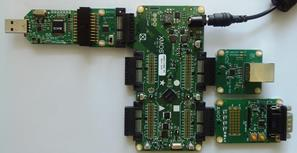
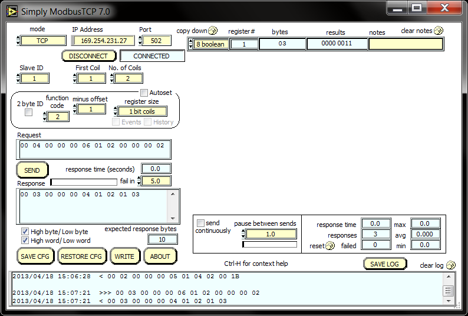
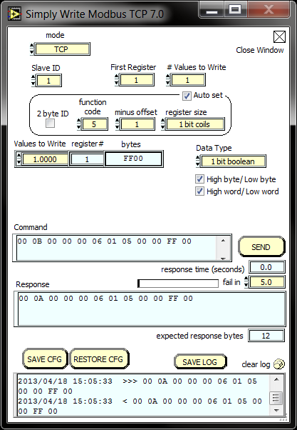
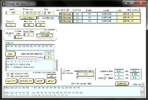
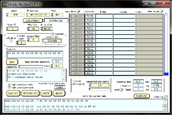

Modbus TCP Demo Quickstart Guide
================================

This simple demonstration of xTIMEcomposer Studio functionality that uses the ``XA-SK-E100`` and ``XA-SK-GPIO`` Slice Cards together with the xSOFTip ``module_modbus_tcp`` to demonstrate how the module is used to receive commands from a Modbus Master over TCP and service them to:

- Turn GPIO Slice Card LEDS on and off
- Read the room temperature via the on-board ADC
- Display GPIO Slice Card button presses

Host Computer Setup
+++++++++++++++++++

A Modbus Master application such as Simply Modbus TCP. Simply Modbus PC application is available from http://www.simplymodbus.ca/TCPclient.htm. Download the installer and install the application on your PC by running it. You can open the Modbus master emulator using Start -> All Programs -> Simply Modbus -> Simply Modbus TCP.

*Note: The folder $\\app_modbus_tcp\\simplymodbus_config\\ contains sample Simply Modbus TCP specific configuration files to perform Read / Write operations. These files can be loaded by clicking on 'Restore CFG' button from the Simply Modbus PC application.*

Hardware Setup
++++++++++++++

The Modbus TCP Demo Application requires the following items:

- XP-SKC-L2 Slicekit Core board marked with edge connectors: ``SQUARE``, ``CIRCLE``, ``TRIANGLE`` and ``STAR``.
- XA-SK-E100 Ethernet Slice Card
- XA-SK-GPIO GPIO Slice Card
- XTAG2 and XTAG Adapter
- Ethernet Cable and 
- 12V DC power supply

To setup up the system:

#. Connect XA-SK-E100 Slice Card to the XP-SKC-L2 Slicekit Core board using the connector marked with the ``CIRCLE``.
#. Connect XA-SK-GPIO Slice Card to the XP-SKC-L2 Slicekit Core board using the connector marked with the ``SQUARE``.
#. Connect the XTAG Adapter to Slicekit Core board, and connect XTAG-2 to the adapter.
#. Connect the XTAG-2 to host PC. Note that the USB cable is not provided with the Slicekit starter kit.
#. Connect an Ethernet cable between the XA-SK-E100 Slice Card and host PC.
#. Switch on the power supply to the Slicekit Core board.

   Hardware Setup for a Modbus TCP Demo

   
Import and Build the Application
++++++++++++++++++++++++++++++++

#. Open xTIMEcomposer and check that it is operating in online mode. Open the edit perspective (Window->Open Perspective->XMOS Edit).
#. Locate the ``Modbus TCP Demo`` item in the xSOFTip pane on the bottom left of the window and drag it into the Project Explorer window in the xTIMEcomposer. This will also cause the modules on which this application depends to be imported as well.
#. Click on the ``app_modbus_tcp`` item in the Project Explorer pane then click on the build icon (hammer) in xTIMEcomposer. Check the console window to verify that the application has built successfully.

For help in using xTIMEcomposer, try the xTIMEcomposer tutorial, which you can find by selecting Help->Tutorials from the xTIMEcomposer menu.

Note that the Developer Column in the xTIMEcomposer on the right hand side of your screen provides information on the xSOFTip components you are using. Select the module_modbus_tcp component in the Project Explorer, and you will see its description together with API documentation. Having done this, click the `back` icon until you return to this quick start guide within the Developer Column.

Run the Application
+++++++++++++++++++

Now that the application has been compiled, the next step is to run it on the Slicekit Core Board using the tools to load the application over JTAG (via the XTAG2 and XTAG Adapter card) into the xCORE multicore microcontroller.

- Select the file ``app_modbus_tcp.xc`` in the ``app_modbus_tcp`` project from the Project Explorer.
- Click on the ``Run`` icon (the white arrow in the green circle).
- At the ``Select Device`` dialog select ``XMOS XTAG-2 connect to L1[0..1]`` and click ``OK``.
- The console output should print an IP address.

   Example: IP address: 169.254.231.27

- On your PC, open the SimplyModbus Client from Start -> All Programs -> Simply Modbus -> Simply Modbus TCP and adjust to following settings:

   - mode = TCP
   - IP Address = user ip address provided in app_modbus_tcp.xc
   - Port = 502 (Modbus Listening Port)

- Alternatively, load the read_coil configuration file from $\\app_modbus_tcp\\simplymodbus_config\\ and click ``CONNECT``.

.. figure:: images/init.png
   :align: center

- Send a command as 'Read Coil' (load read_coil config from $\\app_modbus_tcp\\simplymodbus_config\\). This will read the status of GPIO LED on XA-SK-GPIO slice card. To read the status of the other three LEDs, change the ``First Coil`` value in the SimplyModbus application to appropriate values. The result is a byte containing the status of LEDs arranged as bit positions:

   +----+----+----+----+------+------+------+------+
   | XX | XX | XX | XX | LED3 | LED2 | LED1 | LED0 |
   +----+----+----+----+------+------+------+------+

   Where,
   
   * Bit0 is LED0 status (1 is OFF and 0 is ON)
   * Bit1 is LED1 status (1 is OFF and 0 is ON)
   * Bit2 is LED2 status (1 is OFF and 0 is ON)
   * Bit3 is LED3 status (1 is OFF and 0 is ON)
   * XX is Don't care.

- Send a 'Read Input Register' (load config from $\\app_modbus_tcp\\simplymodbus_config\\) command to read the current room temperature as recorded by the sensor present on the XA-SK-GPIO slice card. The result is a short integer representing the room temperature as responded by the Modbus slave.

   

- Send a 'Read Discrete Input' (load config from $\\app_modbus_tcp\\simplymodbus_config\\) command to read button status on the XA-SK-GPIO slice card. The result is a byte of format:

   +----+----+----+----+----+----+-----+-----+
   | XX | XX | XX | XX | XX | XX | SW2 | SW1 |
   +----+----+----+----+----+----+-----+-----+

   Where,
   
   * Bit0 is SW1 status (1 is Button Pressed and released)
   * Bit1 is SW2 status (1 is Button Pressed and released)
   * XX is Don't care.
 

   
      
- You can write using the ``WRITE`` interface. This can be brought up by clicking the ``WRITE`` button in SimplyModbus. Load the write_coil config in ``WRITE`` window. Sending the command will toggle the requested LED. The position of LED is similar to 'Read Coil' command. To toggle other LEDs, change the 'First Register' value in the WRITE interface window.

User can change appropriate values of address and data based on your application. Any unsupported Function code or data range will result in exception response. 

For example, when a Function code '7' (Read Exception Status) is sent to the slave, the slave returns an 'Illegal Function Code' error response as the slave does not support this command.

Another example where the number of coils in 'Read Coil' (function code '1') command is set to 80000 and is sent to Modbus slave. The slave returns an 'Illegal Data Value' error response as that number of coils is not supported by the slave.

Next Steps
++++++++++

.. list-table:: Project structure
  :header-rows: 1
  
  * - Project
    - File
    - Description
  * - module_modbus_tcp
    - ``modbus_tcp.h`` 
    - Header file containing the APIs for the Modbus TCP component
  * - app_modbus_tcp
    - ``app_modbus_tcp.xc``
    - File containing main() function for the application. Also contains Modbus call-back functions implementation.

The ``module_modbus_tcp`` has an in-built Ethernet and TCP Server components. It uses the ``sc_ethernet`` and ``sc_xtcp`` xSOFTip to receive Modbus commands over TCP. 

Try connecting the coils and registers to show other values. For example, a Read register command from Modbus Master should always read a specific address from the memory. 
