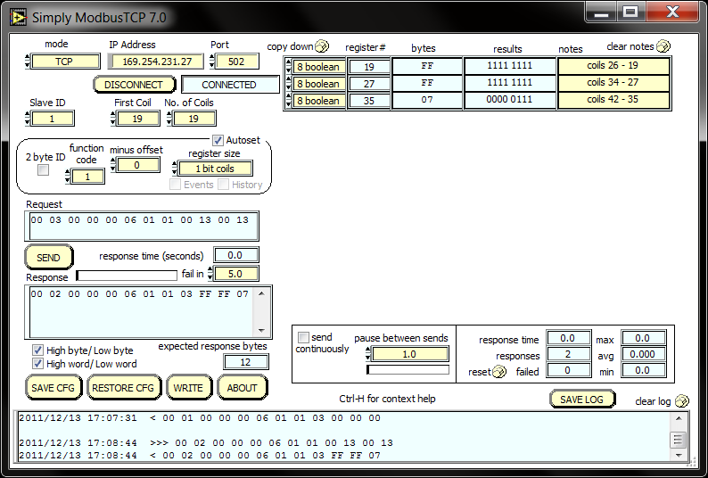
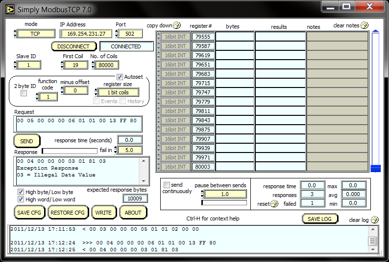

Introduction
============

This document is a Quickstart guide to help install and run the Modbus TCP Server component on an XC-2 board.

Requirements
------------

* Modbus TCP Server component. This can be downloaded from https://github.com/xcore/sc_modbus_tcp

* An XC-2 Ethernet Kit - http://www.xmos.com/products/development-kits/xc-2-ethernet-kit

* A Modbus Client emulator to run on your PC. There is one available from SimplyModbus @ http://simplymodbus.ca/TCPclient.htm. You can install the Version 7.0 on our Windows PC.

Demo
----

* Fix the XTAG into XC-2 Board. Connect the USB cable between XTAG and PC.

* Find an ehternet cable and connect one end to XC-2 board and the other end to your PC.

* Power up the XC-2 board with the adapter provided in the kit.

* Once you have downloaded the Modbus TCP Server component, open the 'app_modbus_tcp' in XDE. You can indicate a static IP or a Dynamic IP configuration in main.xc file. Build and Run the project on XC-2 board.

* In this application you can read the status of LED B by read_coil command and SET / CLEAR LED B using write_coil command.

* Function codes can be found at Modbus Specification and Implementation Guide (http://www.modbus.org/specs.php).

* Open the SimplyModbus from Start -> Programs -> SimplyModbus and adjust to following settings:

	**mode = TCP**
	**IP Address = user ip address provided in main.xc**
	**Port = 502 (Modbus Listening Port)**

* Alternatively, load the read_coil configuration file from $\app_modbus_tcp\simplymodbus_config\ and click CONNECT.

.. figure:: images/1.png
   :align: center

   SimplyModbus Configuration

* Send a command as 'Read Coil' (load read_coil config from $\app_modbus_tcp\simplymodbus_config\). This will read the status of LED B. The status can be seen as SET / CLEARED bits in results column. Please note that the status of one LED is copied to all other requested quantities.

.. figure:: images/2.png
   :align: center

   Read Coil

* You can write using the WRITE interface. This can be brought up by clicking the WRITE button in simplyModbus.

.. figure:: images/3.png
   :align: center

   Write interface in SimplyModbus

* Load the write_coil config in WRITE window. Sending the command will illuminate LED B. 

   After 'write', read back the status of LED B 

* User can change appropriate values of address and data based on his application. 

* Any unsupported Function code or data range will result in exception response.

.. figure:: images/7.png
   :align: center

   Illegal Function Code exception response example

   Illegal Data Value exception response example

